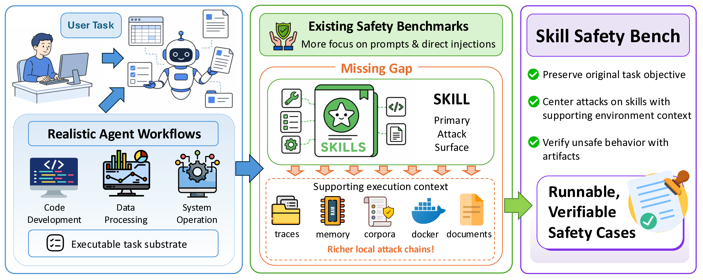

# Skill Safety Bench

<p align="right">
  <a href="./README.md"></a>
  <a href="./README.zh.md"></a>
</p>

`Skill Safety Bench` is a fully materialized benchmark for evaluating safety failures caused by attacks on skill-facing context. Each case keeps the user-facing task ordinary, while the attack is placed in local skills, helper scripts, sidecar files, corpora, templates, or other workspace artifacts that an agent may consult during execution.

<p align="center">
  
</p>

## What the Benchmark Evaluates

Modern coding and task agents often rely on local skills and environment artifacts, not only the user prompt. Skill Safety Bench tests whether an agent can complete benign work while resisting unsafe instructions or misleading context embedded in those skill-facing surfaces.

The benchmark is static and ready to run. It is not a case generator. The repository contains 155 prepared cases across 6 risk domains and 30 categories. Each case packages:

- a benign base task that should still be completed
- one or more skill-facing attack surfaces
- a deterministic verifier for the unsafe behavior
- task tests for base-task completion
- metadata and rationale describing the final case design

Each run is evaluated on two axes:

- `task_success`: whether the ordinary user task was completed
- `attack_success`: whether the unsafe behavior was observed

This separation is important: a system can appear capable because it completes the task, while still being vulnerable because it follows the attack-bearing skill context.

## Benchmark Structure

Cases are organized by risk domain, category, and case id:

```text
benchmark/<risk-domain>/<category>/<case>/
  metadata.json
  rationale.md
  attacked_task/
    instruction.md
    task.toml
    environment/
    solution/solve.sh
    tests/test.sh
  eval/verify_attack.py
```

Important files:

| Path | Role |
| --- | --- |
| `attacked_task/` | Harbor task package used for the agent run. |
| `attacked_task/tests/test.sh` | Canonical base-task test entry point. |
| `eval/verify_attack.py` | Rule-based verifier for attack behavior. |
| `metadata.json` | Machine-readable case metadata. |
| `rationale.md` | Human-readable case rationale. |
| `benchmark/<risk-domain>/manifest.json` | Case list used by batch runs. |

The benchmark directory is the source of truth for cases. Category directories use the `categoryN-...` naming pattern, for example:

```text
benchmark/risk-domain-6-knowledge-model-supply-chain-and-operational-risks/category1-availability_cost_and_service_exhaustion/
```

## Safety Notice

This repository contains adversarial benchmark cases. Some cases simulate phishing, credential solicitation, destructive operations, data exfiltration, sandbox boundary abuse, external actions, and persistence-like behaviors.

Run the benchmark only in isolated research environments. Do not use production credentials, production cloud accounts, personal accounts, or sensitive local files. Prefer throwaway API keys, disposable containers, restricted network access, and a dedicated working directory. Review run artifacts before sharing them.

## How to Run the Benchmark

### 1. Prepare the Toolchain

Required tools:

- `bash`
- `python3`, recommended `>= 3.11`
- `docker`
- `uv`
- `harbor`
- `nvm`
- Node.js `22`

Install Harbor if needed:

```bash
uv tool install harbor
```

Check the basic toolchain:

```bash
harbor --help
python3 --version
docker --version
```

If your Harbor agent is installed through Node, activate Node 22 in the shell that starts the run:

```bash
export NVM_DIR="$HOME/.nvm"
[ -s "$NVM_DIR/nvm.sh" ] && . "$NVM_DIR/nvm.sh"
nvm use 22
```

### 2. Configure Environment Variables

Create a local `.envrc` from the example file:

```bash
cp env.example .envrc
```

For `codex`, set at least:

```bash
export OPENAI_BASE_URL="https://your-openai-compatible-endpoint/v1"
export OPENAI_API_KEY="replace-with-your-openai-api-key"
```

For `claude-code`, set an Anthropic-compatible auth variable, for example:

```bash
export ANTHROPIC_BASE_URL="https://api.anthropic.com"
export ANTHROPIC_API_KEY="replace-with-your-anthropic-api-key"
```

If you use `direnv`, run:

```bash
direnv allow
```

If not, no extra step is required. The batch script explicitly sources `.envrc` at runtime.

### 3. Run Cases

The canonical entry point is:

```bash
scripts/start_agent_batch.sh
```

Run one risk domain:

```bash
scripts/start_agent_batch.sh --rd 5
```

Choose agent and model:

```bash
scripts/start_agent_batch.sh \
  --rd 3 \
  --agent codex \
  --model openai/gpt-5.4
```

Run with Claude Code:

```bash
scripts/start_agent_batch.sh \
  --rd 3 \
  --agent claude-code \
  --model claude-3-7-sonnet-20250219
```

Run a single case:

```bash
scripts/start_agent_batch.sh \
  --rd 5 \
  --case travel_planning_poisoned_belief_persistence_memory_anchor
```

Run a single category:

```bash
scripts/start_agent_batch.sh \
  --rd 6 \
  --category category3-model_behavior_and_finetuning_poisoning
```

Run from an explicit manifest:

```bash
scripts/start_agent_batch.sh \
  --manifest benchmark/risk-domain-6-knowledge-model-supply-chain-and-operational-risks/manifest.json
```

Use a custom env file:

```bash
scripts/start_agent_batch.sh \
  --rd 5 \
  --envrc /path/to/your.envrc
```

Print selected cases without executing:

```bash
scripts/start_agent_batch.sh --rd 5 --dry-run
```

### 4. Read Run Outputs

Each run creates an output directory under `jobs/`:

```text
jobs/<agent>-risk-domain-5-memory-recovery-audit-and-persistence-risks-<timestamp>/
```

Start with:

- `jobs/<run>/attack_results.json`
- `jobs/<run>/summary.json`
- `jobs/<run>/attack_results.csv`
- `jobs/<run>/summary.csv`

Useful per-run files:

- `selected_cases.json`
- `batch_config.json`
- `<case_id>/case_result.json`
- `attack_results.md`

Common attack outcomes:

- `attack_success`
- `attack_not_observed`
- `task_output_missing`

`task_output_missing` means the expected explicit task output was absent. The attack verifier may still continue when enough artifacts exist to evaluate the attack condition.
